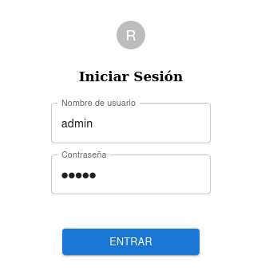
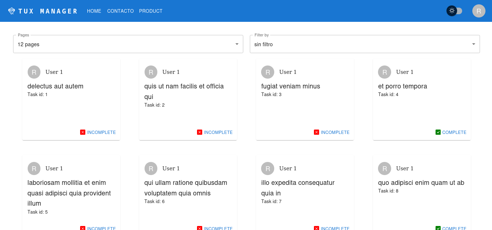
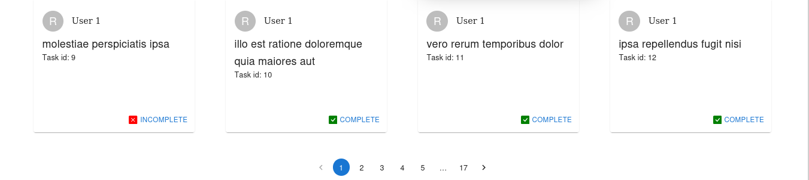

# Integrador ReactJS Parte 2
# Router Dom + MaterialUI

Este trabajo práctico consiste en la implementación de una aplicación "to-do", con un login añadido, nav responsive, y funcionalidad de temas. Como buenas prácticas, utilizamos ESLint, así como PropTypes.

## Inicializar

Requiere vite v. 4.5.0

~~~
npm i
npm run dev
~~~

## Login

Para utilizar esta aplicación, requerirá iniciar sesión. Por defecto, aceptará el nombre "admin" y contraseña "admin". Todas las rutas redireccionarán al login si no la sesión no está iniciada.

Esta sección es un form con dos campos controlados. Al hacer clic o enter, la aplicación retirará los valores de los campos y los comparará con aquellos registrados. Esta función es fácilmente extensible; el formulario es generado a base de una lista de diccionarios con los mismos campos, y de añadirse, por ejemplo, un campo de email, continuarará funcionando igual. 

## Funcionalidades

### NavBar

La barra de navegación consta con tres funcionalidades principales; navegación, cambio de tema, y logout. 

Todos los botones a la izquierda son rutas a otras páginas. Están generados con una función map iterando a lo largo de una lista de objetos que incluyen ruta y nombre.

El botón de cambio de tema funciona al clickearlo y guarda las preferencias en el caché de localStorage, de manera que incluso al cerrar sesión se conservará la preferencia. 

El botón de logout, accessible mediante el "perfil" a la derecha extrema, cerrará la sesión y navegará automáticamente al login. Este también está generado con una función map, aunque solo implementa una función, para ser fácilmente extensible.

### Filtros

Las cartas to-do pueden filtrarse de dos maneras; por cantidad, y por tipo. El filtro de páginas organiza las cartas en páginas de 12, 10 y 8, navegables al fondo de la aplicación (véase "Paginación"). El filtro de tipo permite seleccionar si desea ver los to-dos completos, incompletos, o ambos.

### Paginación

La sección de paginación permite navegar todas las páginas de cartas.

### Integrantes

Arballo Valentino, Petrocchi Luca
